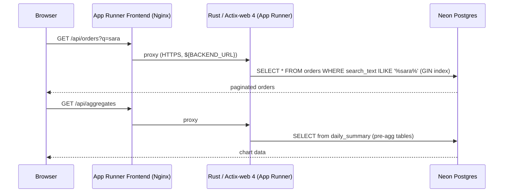

# rust-dashboard-backend — Rust + Actix-web 4 + AWS App Runner

Production-grade **Rust / Actix-web 4** REST API delivering sub-second responses across
4 million orders: full-text search, pre-aggregated analytics tables, serverless autoscaling,
custom Flyway-style migration runner, and database on Neon serverless Postgres. Deployed as
an AWS App Runner service — images built remotely via AWS CodeBuild and stored in ECR.

---

## Live Service

| Endpoint | URL |
|---|---|
| **API Explorer** | available on demand |
| **Portfolio demo** | https://bganguly.github.io/#rust_dashboard |

> App Runner scales to zero when idle; run `deploy.sh` to provision AWS infrastructure and start the service.

---

## Using the App

Open **`/api-explorer`** on the running frontend to run live requests against every endpoint from the browser — no curl required.

1. **List orders** — `GET /api/orders` returns a paginated, date-sorted list of orders; response header shows total row count and query time.
2. **Full-text search** — `GET /api/orders?q=<term>` hits the GIN index on the denormalized `search_text` column; sub-second response times on 4 M+ rows.
3. **Aggregates** — `GET /api/aggregates?from=<date>&to=<date>&topCategories=<n>` returns daily order totals and revenue by product category from pre-aggregated summary tables.
4. **Customers** — `GET /api/customers` lists customers; supports optional `q` filter.
5. **Regions** — `GET /api/regions` returns the distinct region list used by the filter sidebar in the frontend.
6. **Runtime** — `GET /api/runtime` returns runtime info (`rust`, `actix-web`, uptime, row counts).

---

## Architecture

### Search & chart request flow — step by step

1. **Browser → Nginx frontend** — the React UI sends `GET /api/orders?q=sara` to the App Runner frontend service (Nginx on port 8080), which substitutes `${BACKEND_URL}` from env at container start and proxies `/api/*` to the Rust backend over HTTPS.
2. **Rust → search** — Actix-web routes the request to the orders handler; sqlx queries `SELECT * FROM orders WHERE search_text ILIKE '%sara%'` against Neon Postgres via the GIN index.
3. **Chart path** — `GET /api/aggregates` is served entirely from pre-aggregated `daily_summary` tables; Rust never touches raw `orders` on the chart path.
4. **Credential injection** — `DATABASE_URL` is passed as an App Runner env var at deploy time from `deploy.sh`; no Secrets Manager required at this scale.
5. **Results → browser** — Rust returns paginated JSON; the React frontend renders the orders table and Recharts chart.



### Topology

```
┌─────────────────────────────────────────────────────────────────────────┐
│                              AWS Account                                │
│                                                                         │
│   ECR (Elastic Container Registry)                                      │
│   ┌──────────────────┐                                                  │
│   │  frontend image  │    ◄── AWS CodeBuild (deploy.sh, S3 source)     │
│   │  backend image   │         multi-stage Dockerfile                  │
│   └──────────────────┘                                                  │
│           │ image pull                                                  │
│           ▼                  App Runner (no Pulumi / Terraform)         │
│                                                                         │
│  App Runner: rust-dash-frontend                                         │
│  ┌─────────────────────────┐   App Runner: rust-dash-backend            │
│  │ Nginx (port 8080)       │   ┌────────────────────────┐               │
│  │ • serves Vite dist      │   │ Rust / Actix-web 4     │               │
│  │ • proxies /api/* ───────┼──►│ • REST /api/*          │               │
│  │   ${BACKEND_URL} env    │HTTPS• Flyway-style SQL     │               │
│  │ • 1–2 instances         │   │   migrations           │               │
│  └─────────────────────────┘   │ • sqlx connection pool │               │
│           ▲                    │ • 1–2 instances        │               │
│           │ HTTPS              └──────────┬────────────┘               │
│       Browser                             │ HTTPS                       │
└───────────────────────────────────────────┼─────────────────────────────┘
                                            │
                              ┌─────────────▼──────────┐
                              │  Neon serverless PG    │
                              │  (external, shared)    │
                              │  • orders (4 M rows)   │
                              │  • GIN index           │
                              │  • pre-agg summary     │
                              │  • auto-suspends idle  │
                              └────────────────────────┘

Deploy flow
───────────
local machine
  └─ rust-dashboard-backend/scripts/deploy.sh
       ├─ DB prompt: auto-detects Neon URL from sibling repo .env* files
       ├─ psql preflight check → fails fast on bad URL
       ├─ zip source → upload to S3 → CodeBuild builds image → ECR (content-hash skip)
       └─ aws apprunner update-service rust-dash-backend
            writes .env.aws with BACKEND_URL for frontend deploy

  └─ rust-dashboard-frontend/scripts/deploy.sh  (separate step)
       ├─ reads BACKEND_URL from backend .env.aws
       ├─ zip source → upload to S3 → CodeBuild builds image → ECR
       └─ aws apprunner update-service rust-dash-frontend
            with BACKEND_URL env var → Nginx template substitution
```

### Key design decisions

| Concern | Approach |
|---|---|
| **Search performance** | Denormalized `search_text` column with one GIN index — sub-second ILIKE on 4 M rows, single index hit per query |
| **Chart performance** | Pre-aggregated `daily_summary` tables — chart queries never touch raw `orders` on the hot path |
| **Migration runner** | Custom Flyway-style versioned SQL files in `migrations/` (V1–V11) — runs at server startup, no external framework |
| **Connection pooling** | sqlx `PgPool` — connections reused across requests, no per-request connect overhead |
| **No IaC overhead** | `aws apprunner update-service` called directly from `deploy.sh` — zero Pulumi/Terraform state files, simpler ops |
| **BFF proxy** | Nginx frontend substitutes `${BACKEND_URL}` at container start via `nginx.conf.template`; browser sees a single origin, no CORS |
| **Content-hash image tags** | SHA256 of `src/` + `migrations/` + `Dockerfile` + `Cargo.toml` — skips CodeBuild when nothing changed |

---

## Stack

| Component | Implementation |
|---|---|
| **Rust back-end** | Rust, Actix-web 4, sqlx, tokio, serde |
| **PostgreSQL — SQL, DML/DDL, performance tuning** | Neon serverless Postgres; custom Flyway-style SQL migrations; GIN index; pre-aggregated summary tables for sub-second chart queries on 4 M rows |
| **Serverless / cloud-native computing** | AWS App Runner — images in ECR; min-instances: 1, max-instances: 2, scales to zero effectively at idle |
| **CI/CD pipelines** | `deploy.sh` — CodeBuild (S3 source upload) → ECR → `aws apprunner update-service` |
| **Secrets management** | `DATABASE_URL` passed as App Runner env var at deploy time — no Secrets Manager overhead |
| **BFF / integration layer** | Nginx frontend proxies `/api/*` to Rust backend via `${BACKEND_URL}` env var; no CORS required |
| **RESTful APIs / microservices** | Two independent App Runner services; paginated list endpoint + aggregates endpoint |
| **Performance optimization** | Sub-second ILIKE search on 4 M rows via GIN index; pre-aggregated daily tables cut chart query time from seconds to milliseconds |
| **System design diagrams** | See architecture section above |

---

## Deployment / Running

```bash
./scripts/deploy.sh      # local [1] or AWS [2]
./scripts/infra-down.sh  # teardown AWS stack
```

`./scripts/deploy.sh` prompts for local or AWS. The AWS remote flow:

| Step | What happens |
|---|---|
| **Check AWS access** | Verifies `aws` CLI and `sts get-caller-identity` |
| **DB prompt** | Auto-detects Neon URL from sibling repo `.env*` files; shows masked URL; Y to reuse or enter new |
| **DB preflight** | Verifies `psql` connectivity to Neon before building the image — fails fast on bad URL |
| **Build backend image (if needed)** | Hashes `src/` + `migrations/` + `Dockerfile` + `Cargo.toml` → 16-char tag; skips CodeBuild if already in ECR |
| **Deploy App Runner** | `aws apprunner update-service rust-dash-backend` with `DATABASE_URL`, `CORS_ORIGIN`, `MIGRATIONS_DIR`, `PORT`, `RUST_LOG` env vars |
| **Write `.env.aws`** | Saves `BACKEND_URL`, `DATABASE_URL`, `SERVICE_NAME`, `SERVICE_ARN` for use by the frontend deploy script |

### Cost

| Resource | Cost |
|---|---|
| **App Runner** | Min 1 instance — ~$5–7/mo at idle |
| **Neon Postgres** | Free tier — auto-suspends when idle (~$0/mo) |
| **ECR** | Negligible at demo image count |
| **CodeBuild** | Free tier covers demo-frequency builds (Rust compile ~5–10 min cold, cached thereafter) |

---

## Scale & Performance

> **4 M+ orders** in Neon serverless Postgres — sub-second full-text search via GIN index on a denormalized `search_text` column; millisecond chart aggregates via pre-aggregated summary tables; zero sequential scans on the hot path.

```
Browser ──HTTPS──► Nginx / App Runner ──proxy /api/*──► Rust / Actix-web 4 (App Runner) ──HTTPS──► Neon Postgres
                   rust-dash-frontend                    rust-dash-backend                           4 M+ rows · GIN index
                   1–2 instances                         1–2 instances                               pre-agg summary tables
```
